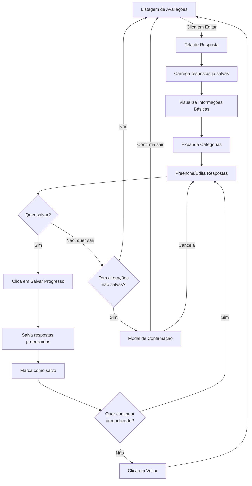

# Tela de Resposta de Avaliação

## Visão Geral

A tela de resposta de avaliação (`EvaluationResponse.tsx`) permite que avaliadores preencham avaliações de colaboradores baseadas em um modelo de avaliação pré-definido.

## Navegação

- **Origem**: Página de listagem de avaliações (`/employee-evaluations`)
- **Ação**: Clicar no botão de editar (ícone de lápis) em uma linha da grid
- **Destino**: `/employee-evaluations/:id`

## Estrutura da Tela

### 1. Card de Informações Básicas (Topo)

Exibe os dados principais da avaliação:
- **Avaliado**: Nome do colaborador sendo avaliado
- **Avaliador**: Nome do gestor responsável pela avaliação
- **Modelo de Avaliação**: ID do modelo usado
- **Período da Avaliação**: Data início - Data fim
- **Status**: Badge indicando se está concluída ou pendente

### 2. Perguntas Organizadas por Categoria/Subcategoria

As perguntas são carregadas do modelo de avaliação e organizadas em cards colapsáveis:

#### Hierarquia:
```
📁 Categoria (card com gradiente laranja-vermelho)
  ├─ Perguntas sem subcategoria
  └─ 📁 Subcategoria (card cinza)
      └─ Perguntas da subcategoria
```

#### Tipos de Resposta:

1. **Escala (1-5)**: 
   - Exibe 5 estrelas clicáveis
   - Ao clicar, preenche a avaliação até aquela estrela
   - Mostra o valor selecionado (ex: 3/5)

2. **Texto**:
   - Campo de texto multi-linha (textarea)
   - 4 linhas de altura
   - Placeholder: "Digite sua resposta aqui..."

3. **Sim/Não**:
   - Dois botões lado a lado
   - Botão "Sim" fica verde quando selecionado
   - Botão "Não" fica vermelho quando selecionado

### 3. Rodapé com Botões de Ação

- **Cancelar**: Volta para listagem (com confirmação se houver alterações não salvas)
- **Salvar Respostas**: Grava todas as respostas no banco de dados

## Funcionalidades

### Gerenciamento de Estado em Memória

- Todas as respostas são mantidas em memória durante o preenchimento
- Utiliza `Map<number, QuestionResponse>` para armazenar respostas
- Mudanças disparam `hasUnsavedChanges = true`
- **Respostas já salvas são carregadas automaticamente** ao entrar na tela

### Salvamento Parcial

O sistema **permite salvar a qualquer momento**:
- ✅ Não exige que todas as perguntas obrigatórias estejam preenchidas
- ✅ Salva apenas as respostas que têm algum valor preenchido
- ✅ Mostra quantas respostas foram salvas
- ✅ Permite continuar preenchendo depois
- ✅ Ao reabrir a tela, carrega as respostas já salvas do banco

### Proteção contra Perda de Dados

1. **Navegação no navegador**: 
   - Event listener `beforeunload` exibe: "Você tem alterações não salvas. Se sair da tela, perderá o que foi preenchido."
   
2. **Botão Cancelar/Voltar**:
   - Modal de confirmação: "Você tem alterações não salvas. Se sair da tela sem salvar, perderá o que foi preenchido. Deseja continuar?"
   - Só exibe se houver alterações não salvas

3. **Indicador Visual**:
   - No rodapé, mostra "Você tem alterações não salvas" em laranja quando há mudanças
   - Botão "Salvar Progresso" fica desabilitado quando não há alterações

### Processo de Salvamento

1. **Verifica se há respostas** para salvar
2. **Filtra apenas respostas preenchidas** (com valor não vazio)
3. Deleta respostas antigas da tabela `evaluations_questions_reply`
4. Insere novas respostas com todos os dados necessários:
   - `evaluation_id`
   - `question_id`
   - `category_id`, `subcategory_id`
   - `category`, `subcategory` (texto)
   - `question` (texto da pergunta)
   - `score`, `reply`, `yes_no` (conforme o tipo)
   - `weight`, `reply_type`
5. **Recarrega as respostas** do banco para sincronizar
6. Marca como salvo (`hasUnsavedChanges = false`)
7. Exibe mensagem: "X resposta(s) salva(s) com sucesso! Você pode continuar preenchendo depois."
8. **Não sai da tela** - permite continuar preenchendo

## Estrutura de Dados

### Tabela: `evaluations_questions_reply`

| Campo | Tipo | Descrição |
|-------|------|-----------|
| id | int8 | PK, auto-incremento |
| created_at | timestamptz | Data de criação |
| updated_at | timestamptz | Data de atualização |
| evaluation_id | int8 | FK para `evaluations` |
| category | varchar | Nome da categoria |
| subcategory | varchar | Nome da subcategoria |
| question | varchar | Texto da pergunta |
| score | int4 | Pontuação (1-5) para tipo Escala |
| reply | varchar | Texto livre para tipo Texto |
| yes_no | bool | true/false para tipo Sim/Não |
| weight | int4 | Peso da questão |
| reply_type | varchar | Tipo de resposta |
| category_id | int8 | FK para `domains` (categoria) |
| subcategory_id | int8 | FK para `domains` (subcategoria) |
| question_id | int8 | FK para `questions_model` |

## Design Pattern

Segue o padrão de modal do projeto com algumas adaptações:
- **Cards colapsáveis**: Uso de `ChevronUp`/`ChevronDown` para indicar estado
- **Gradiente de header**: `from-orange-500 to-red-500` para categorias principais
- **Cores de status**: Verde para "Concluída", Amarelo para "Pendente"
- **Ícones**: Lucide React (`Star`, `Save`, `AlertCircle`, `ArrowLeft`)

## Fluxo de Usuário



## Funcionalidades Implementadas

✅ **Salvamento Parcial**: Pode salvar a qualquer momento sem precisar preencher tudo  
✅ **Continuação**: Ao reabrir, carrega as respostas já salvas  
✅ **Proteção de Dados**: Avisa antes de sair se houver alterações não salvas  
✅ **Indicador Visual**: Mostra quando há alterações não salvas  
✅ **Respostas Flexíveis**: Aceita respostas de 3 tipos (Escala, Texto, Sim/Não)  

## Melhorias Futuras

1. **Auto-save**: Salvar automaticamente a cada X segundos
2. **Indicador de progresso**: Mostrar quantas perguntas foram respondidas (barra de progresso)
3. **Buscar modelo de avaliação**: Exibir nome completo do modelo ao invés do ID
4. **Histórico de versões**: Permitir visualizar respostas anteriores caso sejam editadas
5. **Modo de visualização**: Para avaliações já concluídas, mostrar apenas leitura
6. **Comentários adicionais**: Campo livre para observações gerais no final
7. **Validação antes de finalizar**: Botão "Finalizar Avaliação" que valida campos obrigatórios
8. **Timestamp de última edição**: Mostrar quando foi a última vez que salvou
