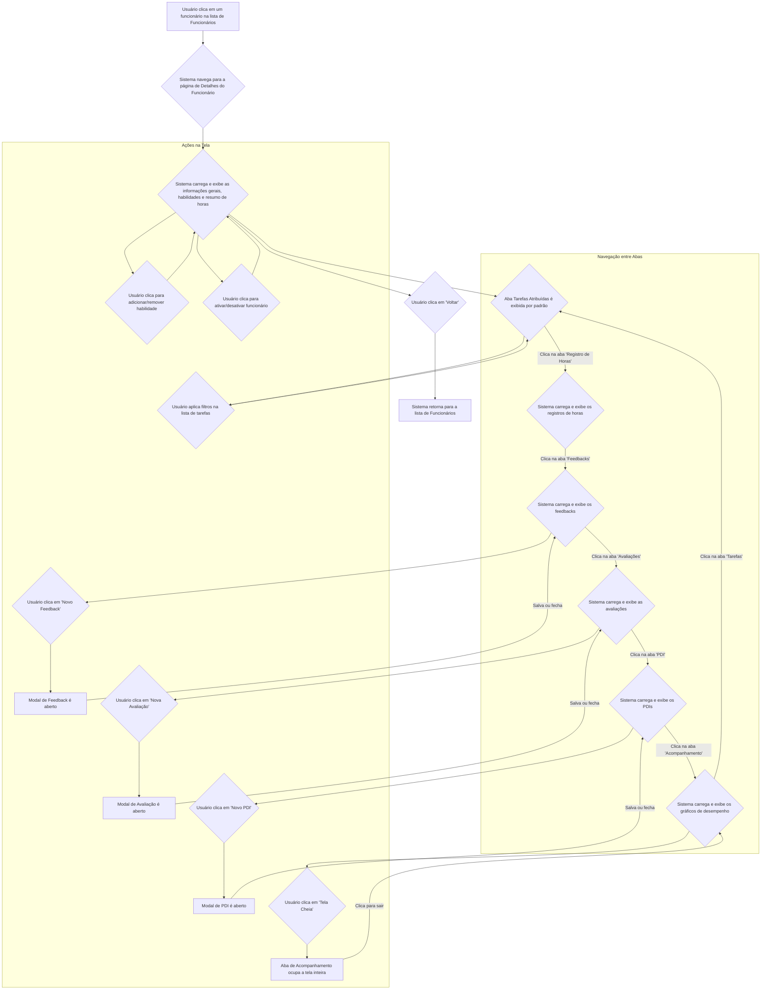
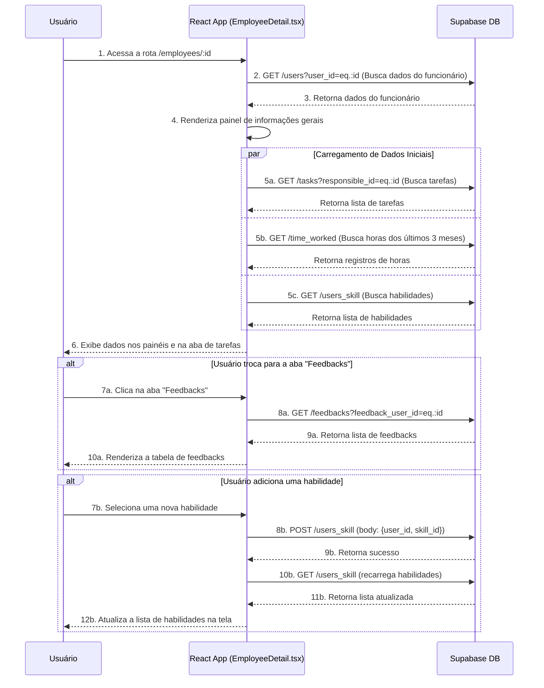

# Fluxo Funcional - Tela de Detalhes do Funcionário

Este documento descreve o fluxo de interação do usuário e o fluxo de dados para a tela de detalhes do funcionário na plataforma EKIP.

## Fluxo de Interação do Usuário (Frontend)

## Fluxo de Dados (Técnico)

