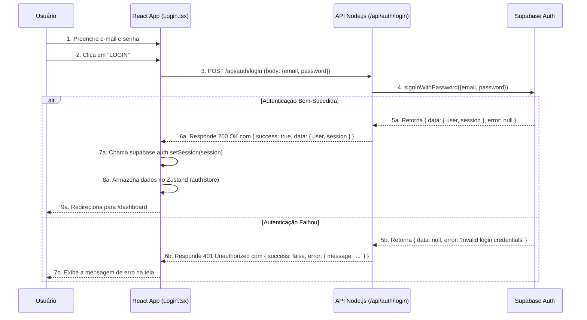

# Fluxo Funcional - Tela de Login

Este documento descreve o fluxo de interação do usuário e o fluxo de dados para o processo de login na plataforma EKIP. Ele pode ser usado como base para a criação de um diagrama visual em ferramentas como o Lucidchart.

## Fluxo de Interação do Usuário (Frontend)

```mermaid
graph TD
    A[Usuário acessa a página de Login] --> B{Formulário de Login é exibido};
    B --> C{Usuário preenche e-mail e senha};
    C --> D{Usuário clica no botão "LOGIN"};
    D --> E[Frontend exibe estado de carregamento (botão desabilitado)];
    E --> F{Frontend envia credenciais para a API Backend};
    
    subgraph Validação de Credenciais
        F --> G{API Backend valida com Supabase Auth};
    end

    G --> H{Credenciais são válidas?};
    H -- Sim --> I[API retorna sucesso com dados do usuário e tokens];
    H -- Não --> J[API retorna erro com mensagem];

    I --> K[Frontend armazena sessão no cliente Supabase e no Zustand];
    K --> L[Usuário é redirecionado para o Dashboard];

    J --> M[Frontend exibe mensagem de erro na tela];
    M --> C;

    C --> N{Usuário clica em "Problema de acesso?"};
    N --> O[Usuário é redirecionado para a página de recuperação de senha];
```

## Fluxo de Dados (Técnico)


