# Projects - Fluxo Funcional

## Fluxo Principal - Listagem de Projetos

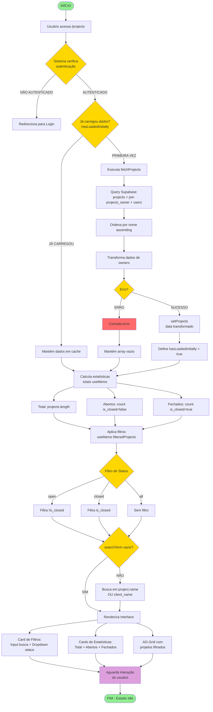

---

## Fluxo de Busca Textual

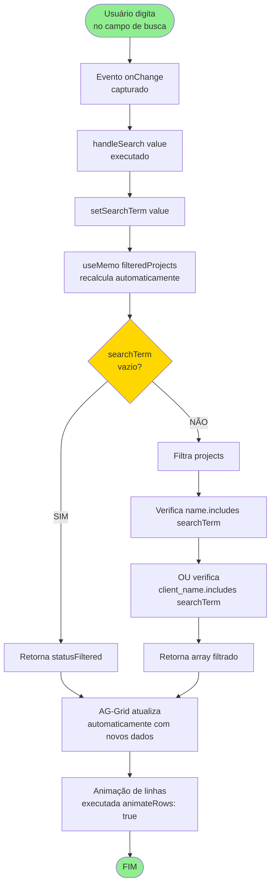

---

## Fluxo de Filtro de Status

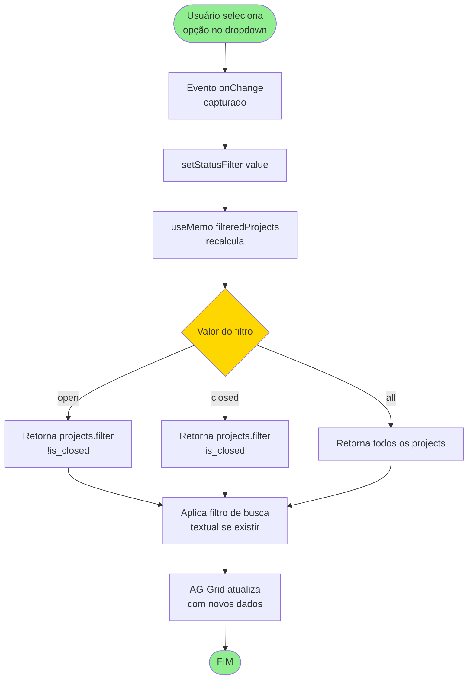

---

## Fluxo de Ordenação de Coluna

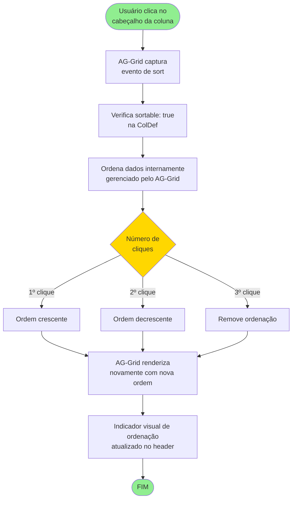

---

## Fluxo de Seleção de Projeto

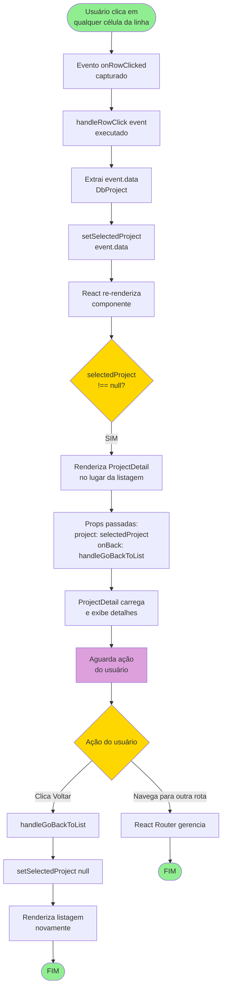

---

## Fluxo de Cálculo de Estatísticas

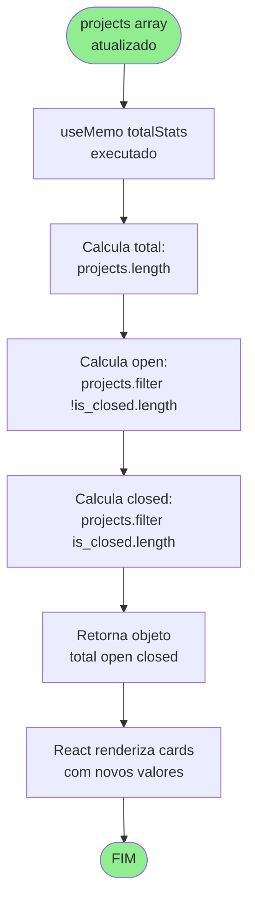

---

## Fluxo de Transformação de Owners

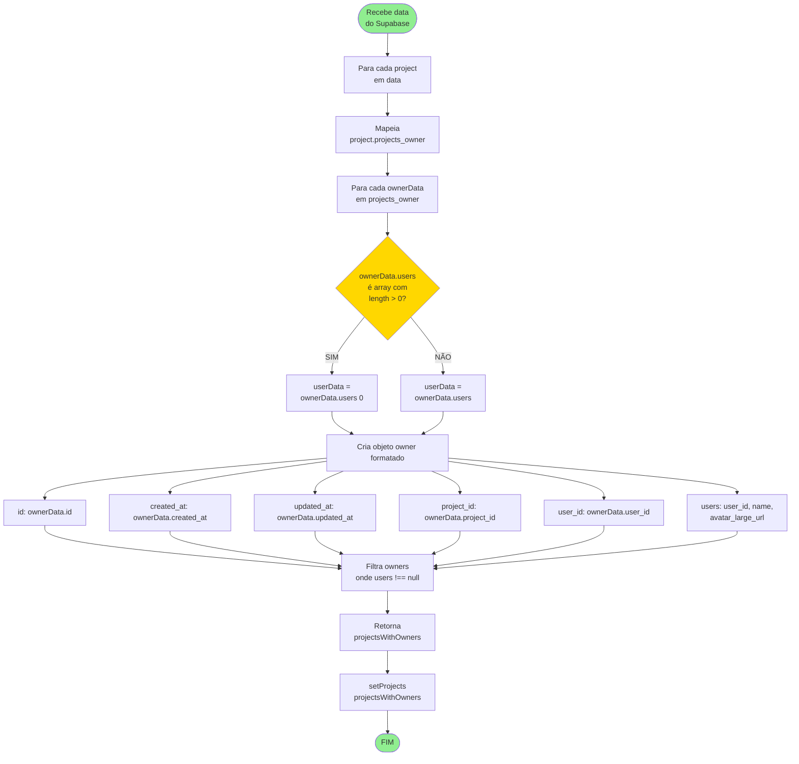

---

## Fluxo de Formatação de Dados

### Formatação de Datas
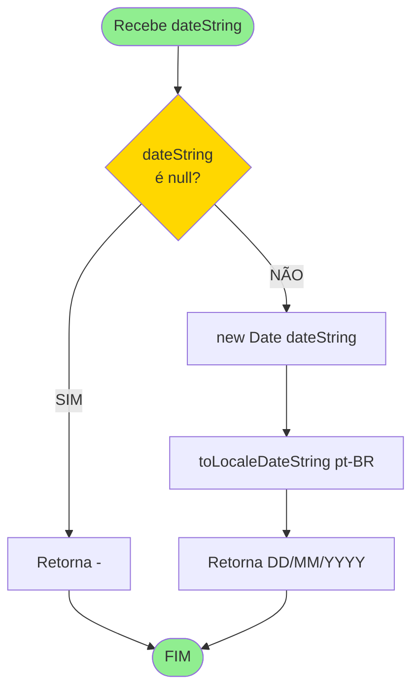

### Formatação de Horas
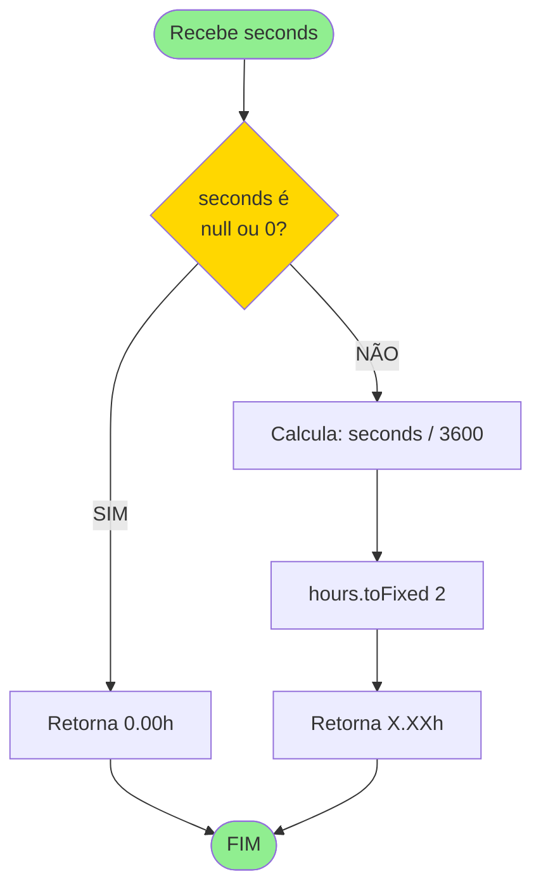

---

## Fluxo de Tratamento de Erro

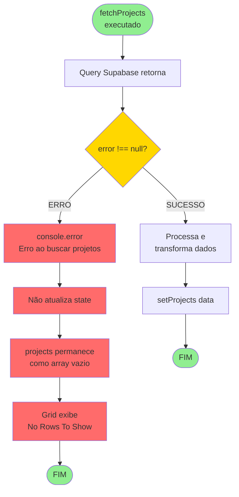

---

## Fluxo de Responsividade

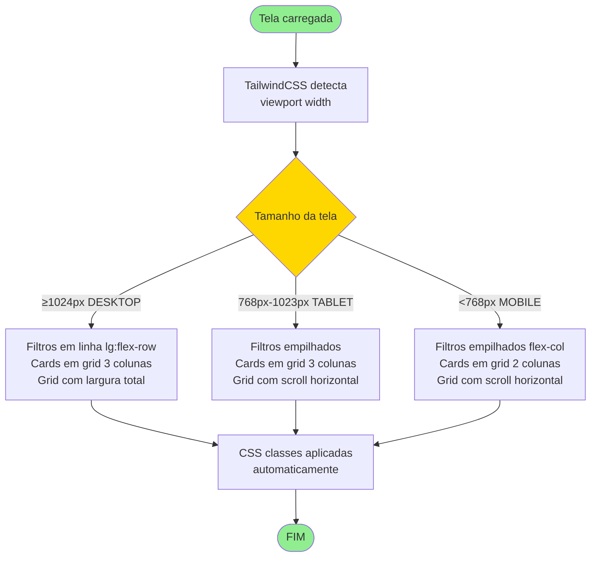

---

## Diagrama de Estados do Componente

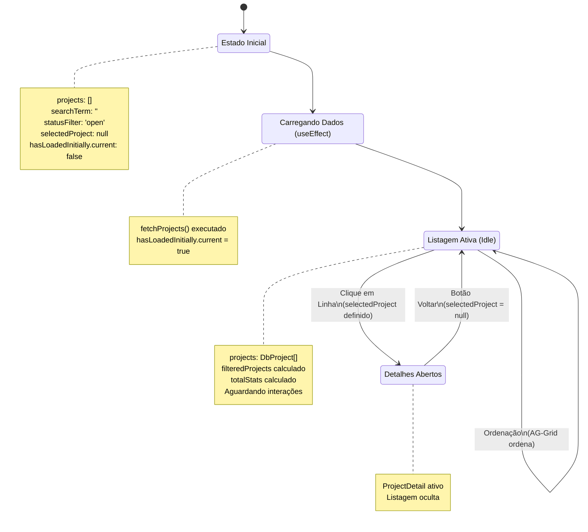

---

## Notas sobre os Diagramas Mermaid

### Visualização
- **VS Code**: Instale a extensão "Markdown Preview Mermaid Support" ou use a visualização nativa (preview disponível desde VS Code 1.72+)
- **GitHub**: Os diagramas Mermaid são renderizados automaticamente
- **GitLab**: Suporte nativo a Mermaid
- **Navegador**: Use extensões como "Markdown Viewer" com suporte Mermaid

### Legenda de Cores
- 🟢 **Verde** (#90EE90): Início/Fim dos fluxos
- 🟡 **Amarelo** (#FFD700): Decisões e pontos de escolha
- 🔴 **Vermelho** (#FF6B6B): Erros e estados de falha
- 🟣 **Roxo** (#DDA0DD): Estados de espera/idle
- 🔵 **Azul** (padrão): Processos normais

### Símbolos Utilizados
- **([texto])**: Início/Fim do fluxo (círculos arredondados)
- **[texto]**: Processo/Ação (retângulos)
- **{texto}**: Decisão/Condição (losangos)
- **Note**: Anotações explicativas

### Edição dos Diagramas
Para editar os diagramas, altere o conteúdo dentro dos blocos \`\`\`mermaid.
Documentação completa: https://mermaid.js.org/
