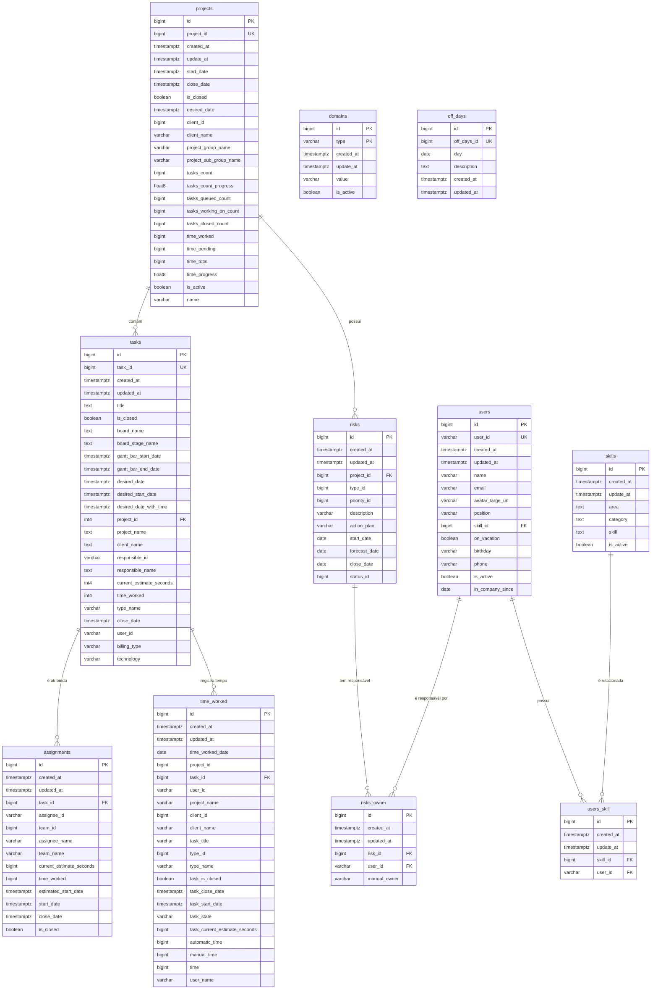

# Diagrama ERD - Banco de Dados Supabase EKIP

## Descrição das Entidades

### 🏢 **Gestão de Pessoas**
- **users**: Funcionários da empresa
- **skills**: Habilidades técnicas
- **users_skill**: Relacionamento N:N entre usuários e habilidades

### 📋 **Gestão de Projetos**
- **projects**: Projetos da empresa
- **tasks**: Tarefas dos projetos
- **assignments**: Atribuições de tarefas para usuários/equipes

### ⏱️ **Controle de Tempo**
- **time_worked**: Registro detalhado de horas trabalhadas

### ⚠️ **Gestão de Riscos**
- **risks**: Riscos identificados nos projetos
- **risks_owner**: Responsáveis pelos riscos

### ⚙️ **Configurações**
- **domains**: Configurações e domínios do sistema
- **off_days**: Feriados e dias não úteis

## Características Técnicas
- ✅ Todas as tabelas possuem **Row Level Security (RLS)** habilitado
- 🔐 Controle de acesso granular aos dados
- 📊 Total de **42,486 registros** distribuídos nas tabelas
- 🕒 Campos de auditoria (created_at, updated_at) em todas as tabelas
